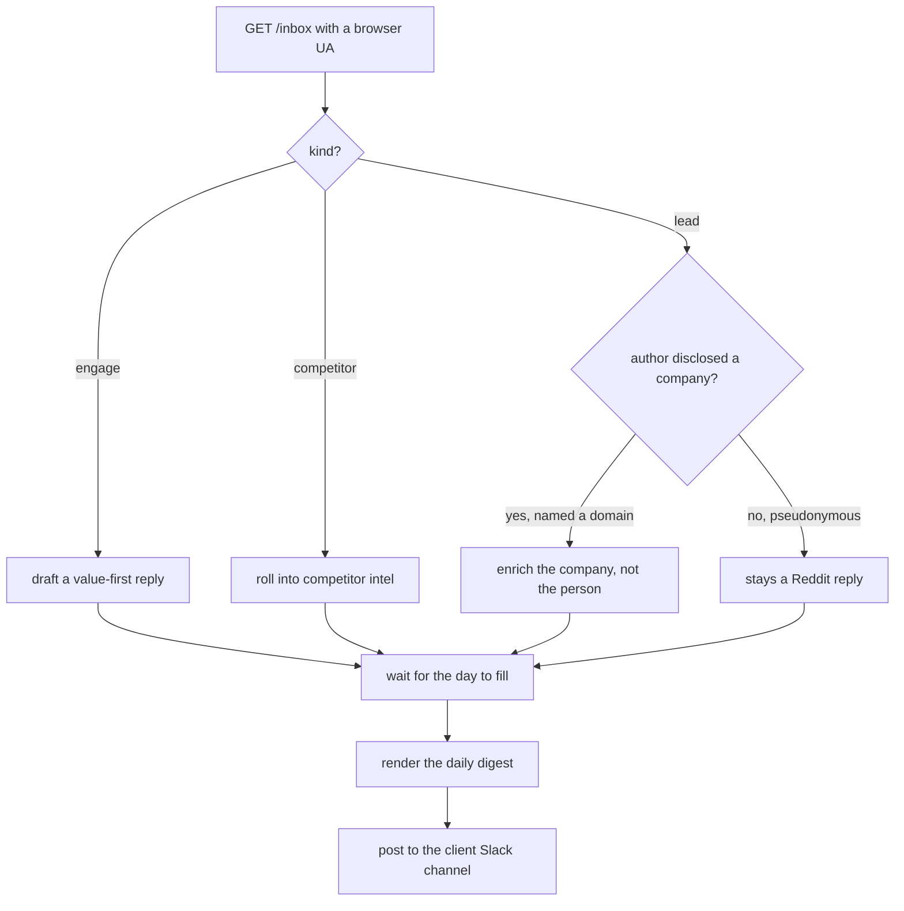

# Chapter 19: Lead Unmasking and the Daily Slack Digest

**This chapter is for the operator running the Reddit engine from Chapter 18
as a service, for a company or for clients. Chapter 18 finds the gap and
scores the plan. This chapter turns each classified opportunity into work a
team acts on. It names the company behind a lead when the author disclosed
one, and it delivers the day's threads, leads, and competitor mentions into
Slack every morning. Two scripts do it, `unmask.py` and `digest.py`, both in
the `reddit-buyer-signals/` starter, both read-only over your data by
default.**

---

## TL;DR

- **Enrich the company, never the person.** Reddit is pseudonymous. You do
  not de-anonymize anyone. You read what the author already tied to a company
  in public and enrich that company.
- **Disclosure is the gate.** A lead qualifies for enrichment only when the
  author named a company, linked a site, or posts as a brand handle. Everything
  else stays a Reddit conversation.
- **Enrichment is pluggable.** Freckle is the default backend. One function
  swaps in Clay, Apollo, or any waterfall the client already runs.
- **The day ends in Slack, not only a sheet.** Each morning the engage
  threads with their drafted replies, the new leads, and the competitor
  mentions land in the team channel, ordered by priority.
- **It is an operated service.** One inbox token per client, one webhook per
  client channel, the same gate and the same timing every day.

---

## Where this sits in the loop

Chapter 18 built the read. The pull, the relevance gate, the scoring, and the
classified opportunity inbox all produce one thing, a list of live buyer
conversations tagged `engage`, `lead`, or `competitor`. That list is the input
to this chapter.

Two jobs remain. Some of those leads belong to a company the author put on the
table in the thread, and that company is worth enriching so a human can reply
with context. And the whole day's work has to reach the people who act on it,
which means Slack, on a schedule, not a sheet someone remembers to open.

---

## The disclosure gate and lead unmasking (unmask.py)

Reddit usernames are pseudonymous by design, and that is the honest starting
point. You are not going to unmask a person, and you should not try. What you
can do is read what an author volunteered about their company, right there in
the thread, and act on that.

So the gate comes first, before any enrichment call. `unmask.py` looks at each
`lead`-classified opportunity and asks a narrow question. Did the author tie
themselves to a company here. Three signals count. They named a company. They
linked a site. Or they post as a brand handle. When one of those is present,
the opportunity carries a disclosed domain and moves to enrichment. When none
is, the opportunity stays a Reddit conversation, and the right move is to reply
on the thread like a human.

```python
DOMAIN_RE = re.compile(r"\b([a-z0-9][a-z0-9-]+\.(?:com|io|ai|co|app|dev))\b", re.I)
IGNORE = {"reddit.com", "youtube.com", "github.com", "linkedin.com", "x.com"}

def disclose(op):
    text = f"{op.get('summary','')} {op.get('snippet','')}"
    for m in DOMAIN_RE.finditer(text):
        dom = m.group(1).lower()
        if ".".join(dom.split(".")[-2:]) in IGNORE:
            continue                                  # a shared link, not their company
        return {"disclosed": True, "domain": dom,
                "action": "reply first, then enrich the company"}
    return {"disclosed": False, "domain": None,
            "action": "stays a Reddit conversation, reply on the thread"}
```

The `IGNORE` set matters. A thread is full of links to Reddit, YouTube, and
GitHub, and none of those is the author's own company. The gate skips them and
keeps only a domain that reads as the author's own. This is the honest version
of unmasking. It reads what the author put in public. It does not de-anonymize
anyone.

### Then enrichment, only on the disclosed company

Once a domain is on the table, `unmask.py` hands it to a pluggable enrichment
backend. The default shells the Freckle CLI, a saved workflow that goes
domain to company, invoke then poll then inspect, and returns the company, the
ICP tier, and the buying-role contacts. The seam is one function, so a client
running Clay or Apollo drops their own waterfall in and the rest of the script
is unchanged.

```python
def enrich(domain):
    """Swap this one function for Clay, Apollo, or any waterfall you run."""
    # default backend: the saved Freckle workflow (invoke -> poll -> inspect),
    # returning the company, the ICP tier, and the buying-role contacts.
    return freckle_enrich(domain)
```

Enrichment never runs without the `--enrich` flag. The default is the gate
alone, no external calls, so you can see who disclosed a company before you
spend a credit.

```bash
# gate only, no external calls, writes who disclosed a company and the domain
python3 unmask.py --ops data/ops_classified.json --out data/unmasked.json

# gate then live-enrich each disclosed domain through your backend
python3 unmask.py --ops data/ops_classified.json --enrich --out data/unmasked.json
```

### A worked example

Say a `lead` opportunity comes through where the author posts as a brand
handle and names a site in the body.

```json
{
  "kind": "lead",
  "author": "AcmeData-Labs",
  "subreddit": "RevOps",
  "summary": "we built acmedata.io to sync CRMs, how do you all handle dupes",
  "permalink": "https://www.reddit.com/r/RevOps/comments/..."
}
```

The gate reads the body, finds `acmedata.io`, confirms it is not in `IGNORE`,
and passes.

```json
{
  "disclosed": true,
  "signal": "company domain in thread",
  "domain": "acmedata.io",
  "action": "reply first, then enrich the company"
}
```

With `--enrich`, the disclosed domain goes to the backend, which returns the
company, an ICP tier, and a buying-role contact.

```json
{
  "domain": "acmedata.io",
  "company": "AcmeData",
  "icp_tier": "A",
  "contacts": [
    {"name": "Dana Ruiz", "title": "Head of RevOps", "role": "buyer"}
  ]
}
```

Nobody was de-anonymized. The author said the company name in public, the gate
read it, and the enrichment ran on the company. A pseudonymous author who
mentions none of the three signals produces a row that says so and stays a
Reddit reply.

---

## The daily Slack digest (digest.py)

A sheet is where the plan lives. Slack is where the team works. `digest.py`
takes the day's classified opportunities and renders one message for the
channel, so the engage threads, the new leads, and the competitor mentions show
up where the account owner already is.

The format is fixed and worth keeping fixed. A header line with the client, the
date, and how many threads there are to work. Then one block per opportunity,
ordered by priority, high first, and capped near ten so the message stays
readable. Each engage block carries the thread, why it is worth answering, the
drafted value-first reply, and a link to open it.

```python
lines = [f"*{client} · {date_str} · {len(engage)} to work*",
         f"_{len(leads)} new leads to enrich · {len(competitors)} competitor "
         f"mentions · reply first, value first_", ""]
for o in engage[:limit]:
    lines.append(f"*[{prio}] {sub}* · {ag}  -  {summary}")
    lines.append(f"   _why:_ {why}")
    lines.append(f"   _reply:_ {angle}")
    lines.append(f"   <{permalink}|open thread>")
```

Rendered, a morning digest reads like this.

```text
*Acme PM · Jul 22, 2026 · 6 to work*
_3 new leads to enrich · 2 competitor mentions · reply first, value first_

*[HIGH] r/RevOps* · 2d  -  team asking how to keep HubSpot and Salesforce in sync
   _why:_ high-intent comparison, no vendor has answered yet
   _reply:_ share the dedupe-before-migrate checklist, answer straight, no pitch
   <https://www.reddit.com/r/RevOps/comments/...|open thread>

*[MED] r/salesforce* · today  -  is there a lighter tool for a 20-person team
   _reply:_ answer the sizing question honestly, name the category
   <https://www.reddit.com/r/salesforce/comments/...|open thread>
```

Posting is opt-in. By default `digest.py` renders to a file and stops. It posts
to Slack only when you pass `--post` and name the secret that holds the
incoming-webhook URL, which is read from your secret store by name and never
hardcoded.

```bash
# render only, writes the digest to a file
python3 digest.py --ops data/ops_classified.json --angles data/engage_angles.json \
    --client "Acme PM" --out data/slack_digest.txt

# render and post live to the client's Slack channel
python3 digest.py --ops data/ops_classified.json --angles data/engage_angles.json \
    --client "Acme PM" --post --webhook-secret SLACK_WEBHOOK_ACME
```

The render-only default is the same safety pattern as every other write in this
repo. You see the message before anyone else does, and the live post takes a
deliberate flag.

---

## The end-to-end loop

Put the two scripts back into the Chapter 18 pipeline and the day runs itself.
Read the inbox, classify each thread, gate the leads, enrich the companies that
disclosed one, let the day fill, then digest the work to Slack.



Every arrow is a script you already have. The inbox pull and classification
come from Chapter 18. The lead gate and enrichment are `unmask.py`. The digest
is `digest.py`. A cron ties them together, one pass a day, and the account owner
opens Slack to a ranked list of work instead of a raw feed.

---

## A repeatable operated service

This is the shape that turns the engine into something you run for more than
one company. Nothing in the pipeline is hardcoded to a single account, so
onboarding a new client is a matter of three values, not a rebuild.

- **One inbox token per client.** The token is a path segment in the inbox URL,
  so each client's opportunities come from their own token and never cross.
- **One webhook per client channel.** The digest posts to a named secret, so
  each client's daily message lands in that client's Slack and nowhere else.
- **The same gate and the same timing, every time.** The disclosure gate, the
  enrichment seam, and the once-a-day cadence are identical across clients. What
  changes per client is the token, the webhook, and the voice profile the
  content pack is written in.

Run it for yourself first. When the loop holds up for a week, the second client
is the same loop with a new token and a new webhook. That repeatability is what
lets one operator carry a book of accounts without the work scaling linearly
with the client count.

---

> 🟧 **Clearbox** is the engine behind this chapter. See your market. Move first. Start a 7-day free trial at [clearbox.to](https://clearbox.to).
