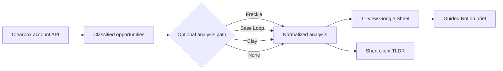

# Build the client Sheet and Notion value pack

Use this contract when a Clearbox user, agency, or operator needs a repeatable client dashboard and guided value brief. The Sheet is the working surface. The Notion page is the readable source of truth that explains what was uncovered, where the value is, how to work it, and how success will be measured.

This skill is mirrored here so the broader GTM Coding Agent curriculum can route and explain the workflow. The maintained executable builder, sanitized fixtures, visual demo, and release gates live in [ClearboxGTM](https://github.com/shawnla90/ClearboxGTM). Start from [v0.10.0](https://github.com/shawnla90/ClearboxGTM/releases/tag/v0.10.0) or newer:

```bash
git clone https://github.com/shawnla90/ClearboxGTM.git
cd ClearboxGTM
pip install -r engine/requirements.txt
```

## The non-negotiable source record

Every row starts with three Clearbox fields that downstream tools do not replace:

1. `id`: the Clearbox opportunity identifier.
2. `kind`: the Clearbox disposition, exactly `lead`, `engage`, or `competitor`.
3. `url`: the exact Reddit permalink.

Freckle, Base Loop, or Clay may add scores, tiers, action lanes, buyer language, content themes, disclosure evidence, and operator guidance. If an analysis tool proposes a different disposition, preserve both values, flag the conflict, and keep the Clearbox disposition as the source record.

## Automated flow



The report can refresh automatically. Reddit account creation, voting, posting, replies, DMs, and marking opportunities complete remain human-authorized actions.

## Pull directly from the Clearbox API

Use the account-scoped base URL from the Clearbox dashboard. Keep it in the environment because the token is part of the URL path.

```bash
export CLEARBOX_ACCOUNT_URL="https://api.clearbox.to/a/YOUR_ACCOUNT_TOKEN"

python3 engine/build_client_pack.py \
  --brand "Acme Ops" \
  --publish-sheet
```

The builder calls `GET /inbox?status=all` with a browser User-Agent. It does not call the done or undone routes. Every returned permalink lands in **Signals** and **Operator Console**.

If the API reports `truncated: true`, the builder refuses to publish a complete pack. Supply a complete export or explicitly allow a clearly partial build. Never present 500 returned rows as a complete 538-row inbox.

## Add Freckle, Base Loop, or Clay

All three tools enter through `--analysis` plus `--backend`. The analysis export must retain the Clearbox opportunity ID.

```bash
# Freckle JSON
python3 engine/build_client_pack.py \
  --ops data/clearbox-inbox.json \
  --analysis data/freckle-analysis.json \
  --backend freckle \
  --brand "Acme Ops"

# Base Loop JSON, including the native rows[].cells shape
python3 engine/build_client_pack.py \
  --ops data/clearbox-inbox.json \
  --analysis data/baseloop-analysis.json \
  --backend baseloop \
  --brand "Acme Ops"

# Clay JSON or CSV export
python3 engine/build_client_pack.py \
  --ops data/clearbox-inbox.json \
  --analysis data/clay-analysis.csv \
  --backend clay \
  --brand "Acme Ops"
```

The [sanitized client-pack examples](https://github.com/shawnla90/ClearboxGTM/tree/main/examples/client-pack) show the three accepted shapes. Field names may use common variants such as `Opportunity ID`, `Clearbox ID`, `AI Priority Score`, `Helpful Reply Angle`, or `Profile Review Verdict`; the builder normalizes them.

### Clay setup for client automation

1. Add an HTTP source for `GET https://api.clearbox.to/a/{TOKEN}/inbox?status=all`.
2. Spread `opportunities[]` into rows.
3. Keep `id`, `kind`, and `url` unchanged.
4. Route by `kind`: leads to the disclosure and enrichment gate, engage rows to reply research, and competitor rows to monitoring.
5. Add analysis columns such as Tier, Total Score, Action Lane, Buyer Language, Buyer Question, Content Topic, Helpful Reply Angle, Analysis Reason, Profile Review Verdict, and Enrichment Eligibility.
6. Export or sync the table as JSON/CSV for `build_client_pack.py`, or map those same normalized columns directly into the Google Sheet tabs.

Use a scheduled Clay refresh or a local scheduler to rerun the pull and builder. Do not expose the source table publicly because the account token is part of the API URL.

## Build the stable client surfaces

The first run may create new private surfaces. Later runs should rebuild them in place.

```bash
python3 engine/build_client_pack.py \
  --brand "Acme Ops" \
  --analysis data/clay-analysis.csv \
  --backend clay \
  --publish-sheet \
  --sheet-id EXISTING_GOOGLE_SHEET_ID \
  --publish-notion \
  --notion-page-id EXISTING_NOTION_PAGE_ID
```

- `--sheet-id` preserves the Google Sheet URL.
- `--notion-page-id` preserves the Notion URL.
- Omit `--share-sheet` to keep a new Sheet private. Share it deliberately before sending.
- A newly created Notion page must be connected to the integration and shared manually if public access is required. Later in-place updates are automatic.

The local run always writes:

- `client_pack.json`: normalized data, metrics, and every delivery view.
- `client_brief.md`: the guided Notion-ready brief.

## The eleven Sheet views

1. **Dashboard:** opportunity counts, dispositions, tiers, and the working recommendation.
2. **Plan Setup:** dropdowns for offer path, who pays, and readiness.
3. **Operator Console:** the ranked working queue with Review Status.
4. **Signals:** Clearbox source evidence, timestamps, snippets, and permalinks.
5. **Buyer Language:** questions, pains, jobs, outcomes, and objections.
6. **Content Topics:** source-backed themes and useful reply angles.
7. **Competitor Sentiment:** competitor dispositions and labeled analysis.
8. **GEO Terms:** buyer questions and search/AI receipt fields.
9. **Disclosure Audit:** profile evidence, review verdict, and enrichment eligibility.
10. **Research Workflow:** client-safe source and analysis fields without private processing identifiers.
11. **Action Legend:** the vocabulary for dispositions, tiers, lanes, and evidence states.

Every client-facing Sheet must keep the exact Reddit permalink visible. A summary without its source URL is not a usable receipt.

## The guided Notion brief

Keep one page as the client-readable source of truth. It must:

- Lead with what value was uncovered and the current counts.
- Link the working Sheet near the top and bottom.
- Show the highest-priority opportunities with exact source links.
- Explain every Sheet tab through compact toggles.
- Explain the automated API-to-pack workflow without linking private processing surfaces.
- Explain the offer path in client language.
- Separate artifact health, search discovery, observed AI answers, exact citations, and business outcomes.
- End with the next working session.

The initial message can summarize the value and point to the Sheet and Notion brief. Follow-up messages should be a TLDR, not a second full value pack.

## Offering and access boundary

The skills, builder, attribution method, and Freckle/Base Loop/Clay adapters are public in this repo. A Clearbox user can use them to build their own client deliverables.

The operated agency offering and multi-offer enablement are not self-serve today. Contact **partners@clearbox.to** when an agency wants the agency offering, an additional offer, or help configuring the delivery model. Do not describe internal billing-provider behavior in client copy. State only that a separate client offer can be added and the client can pay for it.

## Release gate

Before sending a pack:

1. Confirm the API row count is complete and no truncation is hidden.
2. Confirm every row has a valid Clearbox disposition and exact permalink.
3. Review any disposition conflicts instead of silently accepting an analysis override.
4. Confirm the Sheet has all eleven views and working dropdowns.
5. Confirm the Notion page explains the value and every Sheet tab without exposing private processing systems.
6. Verify both shared URLs as the intended recipient.
7. Confirm retrieval is not labeled as an AI citation and AI visibility is not promised.
8. Confirm no Reddit action or opportunity completion happened automatically.
