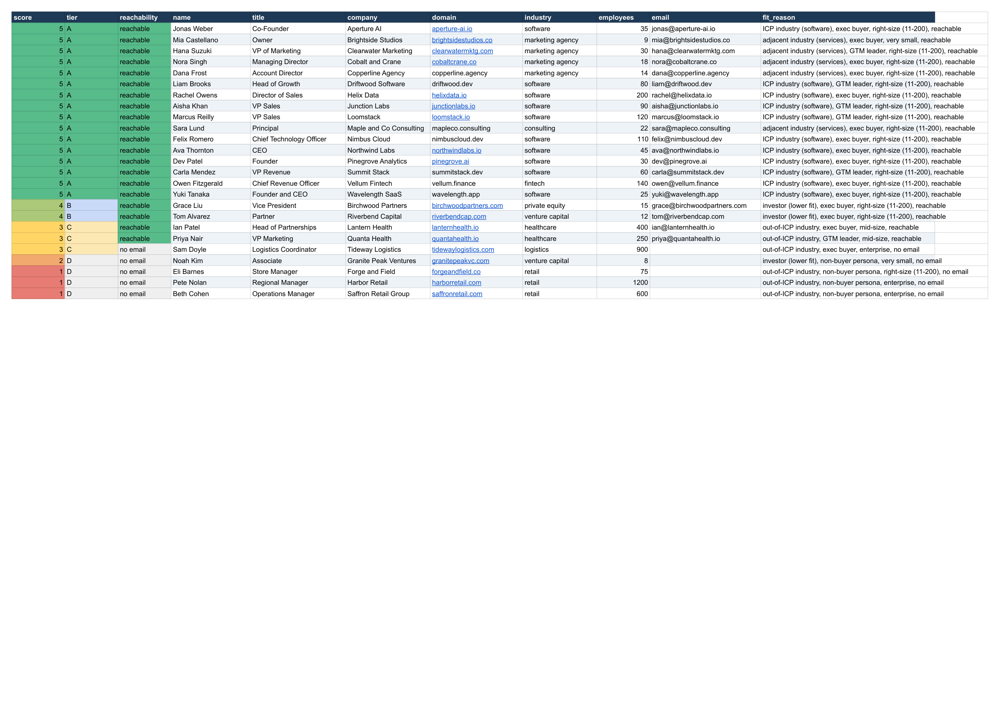

# Market Scoring Sheet

Turn a raw list of companies into a color-coded, scored Google Sheet of your whole market: every account ranked 1 to 5, every score explained, a dashboard on top. This is the runnable version of "The $70K Sheet" build, the kind of market-scoring tool a Clay seat plus an agency would charge five figures for. You own all of it.



The screenshot above is the real output of `python3 build_sheet.py` on the included sample data. Run the four steps below and you get the same thing on your own Google account.

## What it does

```
sample_market.csv  ->  SQLite (local)  ->  score 1-5  ->  color-coded Google Sheet
                            ^
                            └─ optional Apollo enrichment for missing emails
```

- **`init_db.py`** loads the CSV into a local SQLite database, deduped by domain, idempotent.
- **`enrich.py`** (optional) fills missing emails from Apollo. Skips cleanly if you have no key.
- **`score.py`** scores every row 1 to 5 on industry fit, buyer persona, company size, and reachability, and writes a one-line `fit_reason` you get to keep.
- **`build_sheet.py`** renders the scored market as a Google Sheet: red-to-green score gradient, tier colors, a dashboard tab, frozen headers, filters, shared anyone-with-link. Rebuilds in place so the link never changes.

The styling engine is `lib/sheet_engine.py`. It is the real, reusable piece. See [ENGINE.md](ENGINE.md).

## Prerequisites

- Python 3.9+
- A Google account (personal or Workspace) that will own the sheet
- Optional: an Apollo API key, if you want to enrich missing emails

## Setup

### 1. Clone and enter the starter

```bash
git clone https://github.com/shawnla90/gtm-coding-agent.git
cd gtm-coding-agent/starters/market-scoring-sheet
```

### 2. Install the dependencies

```bash
python3 -m venv venv && source venv/bin/activate
pip install -r requirements.txt
```

### 3. Connect Google (the step most copy-paste guides skip)

The builder writes to Google Sheets as you, over OAuth. The first run fails without a token, so do this once:

```bash
python3 setup_oauth.py
```

If you have never made a Google OAuth client, the script prints the exact steps: create a Google Cloud project, enable the Sheets and Drive APIs, make a Desktop OAuth client, download the JSON to `~/.config/gspread/client_secret.json`, then re-run. A browser opens, you sign in, and the token lands at `~/.config/gspread/token.json`. That is the connection that makes everything else work.

### 4. Run the pipeline

```bash
bash run.sh
```

It prints a Google Sheet URL at the end. Open it. That is your market, scored and color-coded.

## Use your own market

Swap the CSV for your own list with the same columns (`company, domain, industry, employees, title, name, email, linkedin`):

```bash
bash run.sh my_list.csv
```

Then open `score.py` and edit the industry, persona, and size maps so the scoring matches your ICP. The rules are plain Python, not a black box.

## Add Apollo (optional)

For B2B SaaS, Apollo is the data layer underneath most enrichment tools. Set a key and `enrich.py` fills missing emails using the real Apollo endpoints (`organizations/enrich`, then `mixed_people/api_search` by `organization_ids`, then `people/match`):

```bash
APOLLO_API_KEY=your_key bash run.sh
```

Apollo is a flat-rate plan; a reveal consumes a credit. Get Apollo: `<YOUR APOLLO REFERRAL LINK>`

## Rebuild in place

`build_sheet.py` stores the sheet URL in `data/sheet_url.txt`. Run it again and it refreshes the same sheet, so any link you have shared stays valid:

```bash
python3 build_sheet.py                 # rebuild the stored sheet
python3 build_sheet.py <sheet_id>      # rebuild a specific sheet
```

## Take it further

- **Cloud master:** mirror the SQLite table to Supabase so a team or a dashboard reads the same data. Idempotent upsert with the header `Prefer: resolution=merge-duplicates`.
- **Schedule it:** wrap `run.sh` in a cron job, or hand the recurring run to an orchestration layer like Deepline (`deepline auth register`, then run it as a play on a cadence).
- **Niche data:** Apollo is the source for B2B SaaS. For local markets (hotels, churches, service companies), swap in an appropriate licensed data provider in `enrich.py`.

## Troubleshooting

- **`Missing ~/.config/gspread/client_secret.json`**: you have not created your OAuth client yet. Run `setup_oauth.py` and follow the printed steps.
- **`invalid_grant` or token errors**: delete `~/.config/gspread/token.json` and run `setup_oauth.py` again.
- **The app is unverified warning**: it is your own app. Click Advanced, then continue.
- **Empty Apollo results**: Apollo's `api_search` only filters by `organization_ids`, which is why `enrich.py` resolves the domain to an org id first.

## Build vs buy

This is build versus buy, with eyes open. Clay is a real tool and the right call for plenty of teams. The point of this starter is that before you sign a five-figure contract, you can build the same scored sheet once yourself and know exactly what that money buys. Want it run on your market for you? That is what [Clearbox](https://clearbox.to) does.
